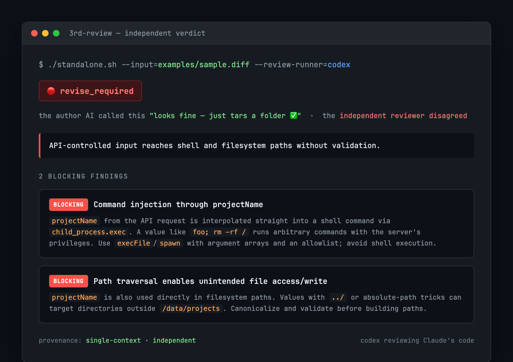

<div align="center">

# 🔍 3rd-review

### The review your AI can't rubber-stamp.

**Get a *second* AI to check your AI's work — so "looks good ✅" actually means something.**

[](https://github.com/Hugh4424/3rd-review/actions/workflows/test.yml)
[](./LICENSE)

[English](./README.md) · [简体中文](./README.zh-CN.md)

<br>



<sub>A real run on [`examples/sample.diff`](./examples/sample.diff): code an AI author would wave through as "just tars a folder" — the independent reviewer caught a command injection and a path traversal in one pass.</sub>

</div>

---

## ✨ The problem, in 10 seconds

You ask an AI to write some code. Then you ask the *same* AI to review it.

> **You:** Review the code you just wrote.
> **AI:** ✅ Looks good, no issues!

Of course it does. It's grading its own homework — and it has the exact same blind spots it had when writing. That green checkmark is **theater.**

`3rd-review` fixes this with one simple rule:

> **The thing that writes the code is never the thing that approves it.**

A *different* engine does the review — OpenAI's `codex`, Google's `gemini`, or at the very least a fresh AI session that can't see the original conversation. An independent second opinion, automatically, every time.

**A true story from running this on our own pipeline:** an AI marked its own change `pass`. We ran it past an *independent* reviewer instead. It took **6 rounds** to genuinely pass — and along the way it caught a CI check that was secretly letting failures through, a shortcut that skipped the safety gate, and a data format that didn't even match. The original "pass" was worth nothing.

---

## 🎯 What you get

| Your situation | What usually happens | With 3rd-review |
|---|---|---|
| AI writes *and* reviews its own work | It approves itself, blind spots and all | A **different** AI gives the verdict |
| A huge, boring diff to review | One reviewer slogs through it all | The grunt work is **split across helpers** |
| A tiny doc typo fix | Full heavyweight review, total overkill | Auto-switches to a quick, cheap check |
| A reviewer that nitpicks forever | You're stuck in an endless loop | It notices the stalling and **calls a human** |
| An AI that fakes a "pass" to look done | Nobody notices | Built-in checks **catch the fake** |

---

## 🚀 Quick start

`3rd-review` runs your code/diff past an independent reviewer and hands back a simple verdict: **pass**, **needs fixes**, or **needs a human**.

**1. You need a "reviewer" — the AI that does the actual checking.** We ship a ready-made one that uses OpenAI's `codex`. (Just need `codex` and `python3` installed.)

**2. Point it at what you want reviewed.** `--input` is the file or diff, `--output-root` is where the report lands, `--review-runner` is who does the reviewing:

```bash
# Smoke-test it on the bundled example (the command-injection diff from the screenshot):
./standalone.sh \
  --input=examples/sample.diff \
  --output-root=./reviews \
  --review-runner="$PWD/examples/codex-runner.sh" \
  --max-revise-rounds=1

# …then point --input at your own file or diff.
```

**3. Read the answer — it's the exit code:**

| Exit code | Meaning |
|---|---|
| `0` | ✅ **Pass** — independently approved |
| `2` | 🙋 **Needs a human** — couldn't settle it (this is also what you get when fixes keep being needed and the rounds run out) |
| other | ⚠️ Something errored |

The full report — what was checked, what was found — lands at `./reviews/tasks/{id}/reviews/report.md`.

> Under the hood there's also a `1` ("needs fixes") verdict, but `standalone.sh` doesn't stop there: when the reviewer asks for fixes, it loops and re-reviews, and only stops — with exit `2` — once a human is genuinely needed (by default after 3 rounds without resolution).

> **Want a different reviewer** (Gemini, a local model, your own setup)? Copy [`examples/codex-runner.sh`](./examples/codex-runner.sh) and swap out the one line that calls `codex`. Any command that reads a prompt and returns a verdict works.

---

## 🛡️ Why you can actually trust the "pass"

A green light is easy to fake. Three guardrails make this one mean something:

- **The reviewer is never the author.** The final call always comes from a separate, independent AI. The whole point is that nobody approves their own work.

- **A "pass" has to show its receipts.** The reviewer can't just say "looks good" — it has to attach proof of *what* it checked: which files, which risky bits it looked at and why it decided they were fine. **No receipts → no pass.** (And it can't fake the judgement part — if it tries to leave that blank, the pass is rejected.)

- **Fakes don't slip through.** A hand-written "pass" with no receipts is rejected outright. And in the full platform setup, every real review leaves a tamper-evident fingerprint that a faked one won't have. *(Honest about the limits: the standalone version leans on the independent reviewer plus the evidence-receipts rule above; the cryptographic fingerprint lives in the platform's gated path. And even that isn't bulletproof against a truly malicious program with full disk access — that needs stronger isolation. This stops accidents and lazy fakes, not a determined attacker.)*

---

## 🧠 The clever bit: review as a dial, not a hammer

Not every change deserves the same scrutiny. A one-word typo and a database migration shouldn't get the same review — that's either overkill or dangerous.

So 3rd-review **automatically picks how hard to review**, based on what changed:

```
   harder / more thorough / costs more
        ▲
        │   Big code change   →  independent AI + helpers split the work
        │   Medium change     →  one independent AI reviews it
        │   Tiny / docs only  →  a quick, cheap isolated check
        ▼
   lighter / faster / cheaper
```

**The one rule that never bends:** anything touching login, data migrations, or deletions gets the **heaviest** review, no matter how small it looks. Risk only ever makes the review *stronger*, never weaker.

> 💡 The insight that took us longest to learn: splitting work across helper AIs isn't about making the review *stronger* — it's about making it *cheaper* on big jobs. Independence is the floor you never give up; cost is the dial you turn.

---

## 🩹 Hard lessons baked in (so you skip the pain)

This tool is the scar tissue from running a real AI dev pipeline. A few bruises that shaped it:

- **The endless-nitpick trap.** One review got stuck for **13 rounds and ~80 minutes** without ever passing — the AI just kept finding a *new* small problem each round (first a typo, then a path, then a naming thing...). A naive "stop after the same complaint 3 times" rule never triggers, because the complaint keeps *changing*. So 3rd-review watches for this stalling pattern and hands off to a human instead of looping forever.

- **The slow review was slow for a dumb reason.** We measured one review: **343 seconds, over a million tokens.** Turned out most of it wasn't *reviewing* — it was the AI re-reading the same unchanging rulebook files every single round. Lesson: measure before you optimize; the bottleneck is rarely where you guess.

- **"Just feed it a description" doesn't work.** If you hand the reviewer a summary like *"please review my plan to do X"* instead of the actual code diff, it quietly does a shallow check. Always give it the **real diff**.

---

## ⚙️ For the engineers

<details>
<summary>Click to expand: the technical details</summary>

**Two entrypoints, one brain.** `standalone.sh` is the off-platform one (what most people use — clean room, no gate, exit-code contract). `review-dispatch-adapter.sh` is the in-platform adapter used inside the agenthub system (persists verdicts, checked by downstream gates) — *not* shipped in this repo. Both share the same routing logic and decision scripts.

**The router is a pure function.** [`scripts/route-review.mjs`](./scripts/route-review.mjs) reads a single data table ([`config/route-rules.json`](./config/route-rules.json)) and decides the review tier from content type + scope + risk keywords. Same input, same output, no hidden state — that's why it's easy to test and trust.

**The runner contract.** A review runner is called as `{runner} --prompt-file=… --result-file=… --review-request-id=…` and must write a JSON verdict to `--result-file`: at minimum `{"verdict": "pass"|"revise_required"|"escalate_to_human", "findings": [...]}`. On a `pass`, standalone **enforces the presence** of three evidence fields — `reviewSnapshot[]`, `riskDisposition[]`, and `worktreeInventory` — and fails fast to escalation if any is missing. It checks they're present and well-formed, not whether the reviewer covered every risk correctly; and `riskDisposition` is never auto-filled (backfilling a judgement would be forgery). Full spec — including the standalone-vs-platform backfill rules — in [`references/pass-evidence-contract.md`](./references/pass-evidence-contract.md).

**The four non-negotiable rails** (no tier can bypass them): ≥80% coverage of changed lines each round; high-risk dimensions always get full review; a reduced-scope review that fails any rail falls back to full scope immediately; and the final verdict must always come from an independent context.

**Verifying:**

```bash
npm test    # routing core (pure-function) + the standalone path, zero deps
```

`npm test` runs the portable suite — pure-function router tests (`route-review`, `cost-compare`, `verdict-core-hash`, all `node:assert`) plus the two standalone integration tests. Green out of the box. *(The other `*.test.mjs` / `*.test.ts` files are coupled to the agenthub monorepo and only run there; they're shipped as reference, not run by `npm test`.)*

**Repository layout:**

```
SKILL.md                  # the thin shell the orchestrating AI reads
standalone.sh             # off-platform entrypoint (start here)
examples/codex-runner.sh  # a working, copy-me review runner (wraps codex)
scripts/route-review.mjs   # pure-function router — the brain
scripts/verdict-core-hash.mjs  # tamper-evident hashing
config/route-rules.json    # the single source of truth for thresholds
references/                # detailed rules, loaded on demand
golden/  __fixtures__/     # test fixtures
```

</details>

---

<div align="center">

**Independence is the floor. Cost is the dial. A pass must show its receipts.**

*Built from the scar tissue of a real multi-agent pipeline — and honest about what it can't guarantee.*

</div>
